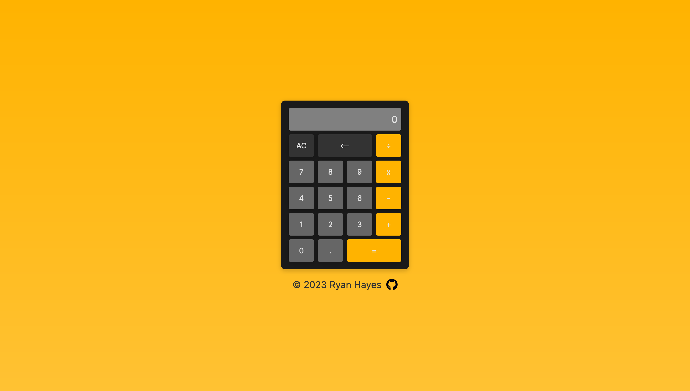

# Calculator App

  <a href="#overview">Overview</a> •
  <a href="#what-i-learned">What I learned</a> •
  <a href="#useful-resources">Useful Resources</a> •
  <a href="#contact">Contact</a>

## Overview 

The goal of the project was to make an on-screen calculator using JavaScript, HTML, and CSS. 

### Features

- A Simple Calculator which is built with **Modern Javascript** practices  
- It can evaluate expressions for Multiplication, Division, Subtraction & Addition 
- Clean UI for better visuals
- **Responsive** for both Desktop & Mobile

### Outcome

* Used HTML5 **semantic elements** for better readability and structure
* Used CSS3 **grid** and **flex** to manage layout
* Used **Data-Attributes** for accessing DOM Elements
* Used **Git** and **GitHub** for project management
* **Cross tested** on Firefox, Webkit, and Chromium based browsers

### Desktop Preview

### Live Version
**[Calculator App](https://ryanthayes.github.io/calculator/)**

### Built With

       

## What I learned

- How to **convert a string to an integer** with **parseFloat**.
- How to select elements on the DOM via **DATA-ATTRIBUTES** to separate from styling with classes.
- How to add **keyboard support** with event listeners (including **preventDefault()** to bypass Quick Look on Firefox from opening when using **'/"**)

## Proud of

## Useful Resources

[Get element(s) by data attribute using JavaScript](https://bobbyhadz.com/blog/javascript-get-element-by-data-attribute)

## Contact

